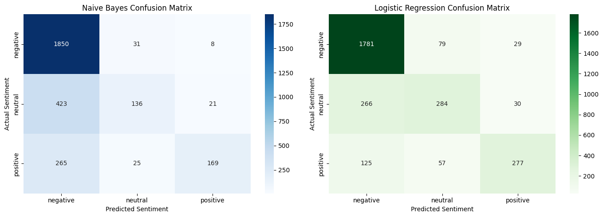
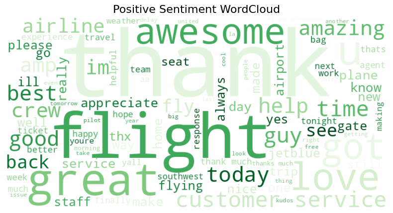

# 📊 Task 4: Sentiment Analysis

## 🎯 Objective
Build a Natural Language Processing (NLP) machine learning model to classify the sentiment of Twitter data (Positive, Negative, or Neutral).

## 🛠️ Tech Stack
* **Language:** Python
* **Libraries:** Pandas, Scikit-learn, NLTK, Matplotlib, Seaborn, WordCloud

## 🚀 Process & Key Findings
1. **Text Cleaning:** Removed mentions, URLs, punctuation, and stopwords, followed by lemmatization.
2. **Feature Extraction:** Used `TfidfVectorizer` to convert text into numerical vectors.
3. **Model Evaluation:** Trained both Naive Bayes and Logistic Regression models. 
   * **Logistic Regression** outperformed Naive Bayes, achieving an accuracy of **~80%**.

## 📈 Visualizations
### 1. Model Performance (Confusion Matrix)

### 2. Sentiment WordClouds

