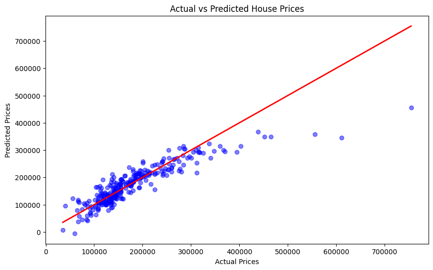
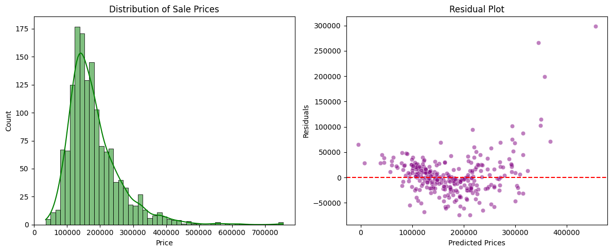

# Predicting House Prices with Linear Regression

## 📌 Project Overview
This project is part of the Oasis Infobyte Data Analytics Internship (Level 2). The objective is to build and evaluate a predictive model that estimates house prices based on key features such as area, location, and quality. A Linear Regression model was deployed to understand the relationships between property characteristics and their final selling price.

## 🛠️ Tech Stack
* **Language:** Python
* **Libraries:** Pandas, Scikit-learn, Matplotlib, Seaborn
* **Environment:** Jupyter Notebook / Google Colab

## 📊 Methodology & Workflow

### 1. Exploratory Data Analysis (EDA)
* **Data Inspection:** Conducted initial checks for dataset shape (1460 rows, 81 columns), data types, and null values.
* **Target Variable:** Analyzed the distribution of the `SalePrice` to understand the market baseline.
* **Correlation Analysis:** Generated a correlation matrix to identify features most strongly correlated with house prices.

### 2. Feature Selection & Engineering
To avoid multicollinearity and reduce model noise, 4 primary independent variables were selected based on their high correlation with the target variable and their distinct business value:
1. `OverallQual` (Overall material and finish quality)
2. `GrLivArea` (Above grade (ground) living area square feet)
3. `GarageCars` (Size of garage in car capacity)
4. `TotalBsmtSF` (Total square feet of basement area)

*Note: Features like `GarageArea` and `1stFlrSF` were intentionally excluded as they provided redundant information (multicollinearity) to `GarageCars` and `TotalBsmtSF`.*

### 3. Model Training
* **Data Splitting:** The dataset was split into 80% training data (1168 records) and 20% testing data (292 records) using `train_test_split`.
* **Algorithm:** A Multiple Linear Regression model was initialized and trained on the selected features.

### 4. Model Evaluation
The model was evaluated using standard regression metrics to quantify its accuracy:
* **R-squared (R²):** 0.791 (The model explains 79.1% of the variance in house prices using only 4 features).
* **Root Mean Squared Error (RMSE):** ~$40,036 (Average prediction error margin).
* **Mean Squared Error (MSE):** ~$1.6B.

### 5. Visualizations
* **Actual vs. Predicted Prices (Scatter Plot):** Demonstrates strong model performance, particularly in the low-to-medium price range (100k - 300k). The model slightly underestimates luxury outliers.
* **Residual Plot:** Confirms that prediction errors are largely randomly distributed around zero, indicating a healthy linear fit without severe systematic bias.
* **Price Distribution:** Visualizes the market spread of the target variable.

### Actual vs. Predicted Prices

### Residuals and Price Distribution

## 💡 Business Insights & Coefficient Analysis
By analyzing the model's coefficients, we extracted the exact dollar value impact of each feature on the final house price:
* **Quality is King:** Every 1-point increase in `OverallQual` adds approximately **$23,766** to the house's value.
* **Garage Capacity:** Adding space for one more car in the garage (`GarageCars`) increases the price by **$19,560**.
* **Living Area:** Every additional square foot of above-ground living space (`GrLivArea`) adds **$42.79**.
* **Basement Area:** Every additional square foot of basement space (`TotalBsmtSF`) adds **$28.40**.
